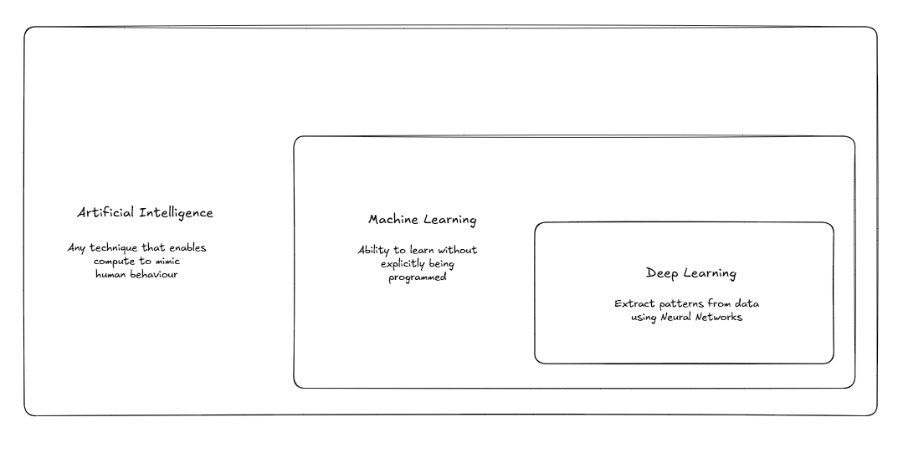
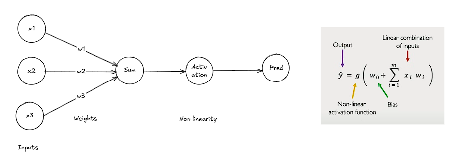
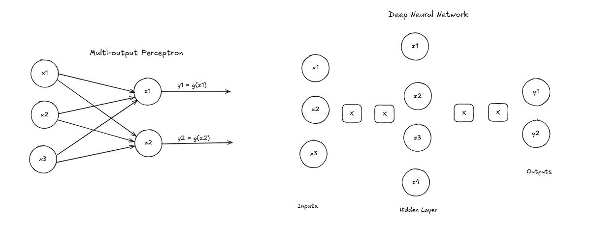
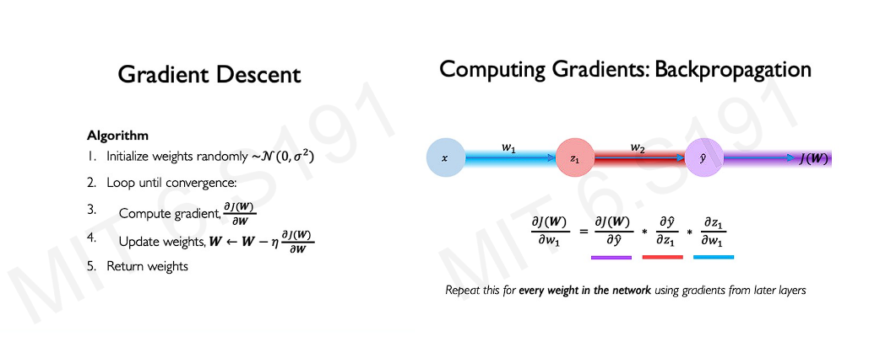
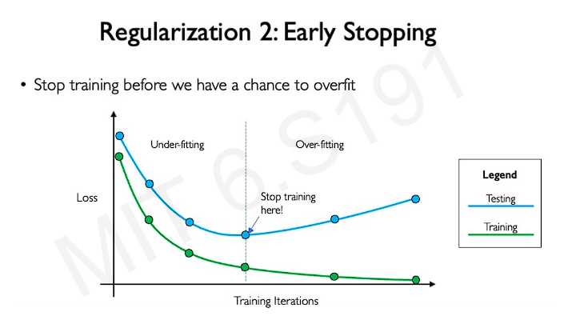
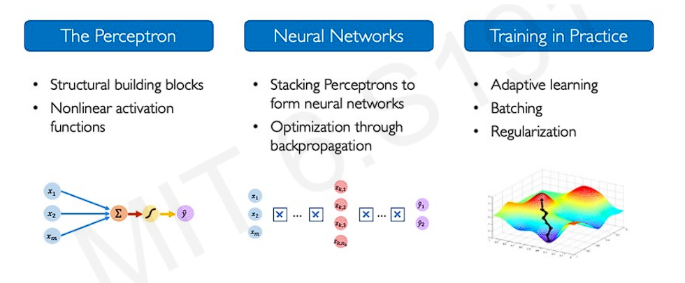

The progress of the deep learning field over the last couple of years is astounding. From creating vague images in 2015 to generating realistic videos with just a few minutes of prompts, the changes are truly remarkable. 

Deep learning aims to extract features from the data. Engineering the features manually is time-consuming, error-prone, and unscalable. Hence, neural networks are used to extract different levels of features in a lower-dimensional scenario.

### Perceptron

A single unit of a neuron in a neural network is referred to as a perceptron. The purpose of the activation function is to introduce non-linearity in the network. This non-linearity enables the network to learn complex models with ease, which would otherwise require a larger network.

### Loss & Gradients

The loss of our network measures the cost of incorrect predictions. Empirical loss measures the total loss across the dataset.
Cross-entropy loss can be used with models that output a probability between 0 and 1. Mean-squared error loss can be used for continuous real numbers.
We aim to determine network weights that yield the lowest loss. The gradient descent algorithm can be used to converge to the lowest loss iteratively.

The way the gradients are calculated in a step-by-step manner from output to input direction is called backpropagation. It's worth noting that the gradient descent algorithm is inherently a greedy approach.

Use an adaptive learning rate to overcome the overshooting and undershooting problems commonly associated with fixed learning rates. Different gradient descent algorithms are proposed based upon different adaptive mechanisms. SGD and Adam are the most widely used variations of gradient descent.

Gradient calculation is expensive. Hence, it is generally computed over a batch.

Additionally, if the training data is small, there's a possibility of model overfitting, where the network memorizes the training data rather than understanding the underlying features, which can increase the validation loss, even though the training loss is minimal. This can be discouraged in different ways. Regularization is one such mechanism; it simply nudges the network to use a simple model.
1. During training, randomly set some activations to 0 with some probability. It prevents the network from depending on any specific node.
2. Early stopping: Stop training before we can have a chance of overfitting

### Concepts covered

### References:
1. [MIT Introduction to Deep Learning | 6.S191](https://www.youtube.com/watch?v=alfdI7S6wCY&list=PLtBw6njQRU-rwp5__7C0oIVt26ZgjG9NI&index=1)
