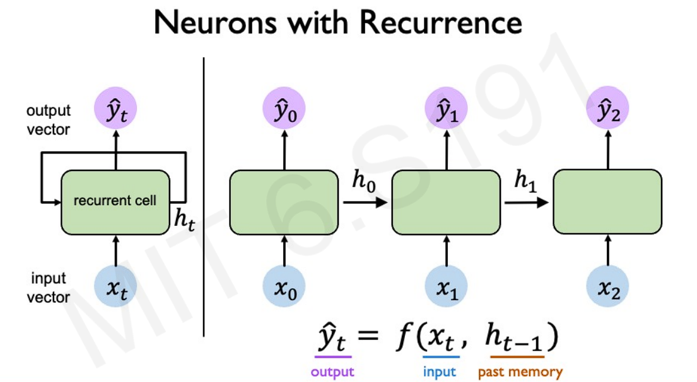
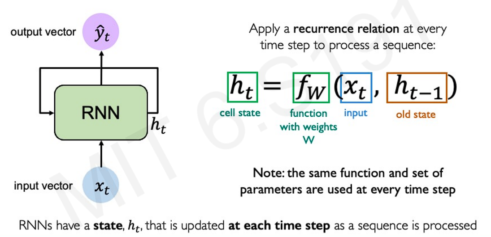
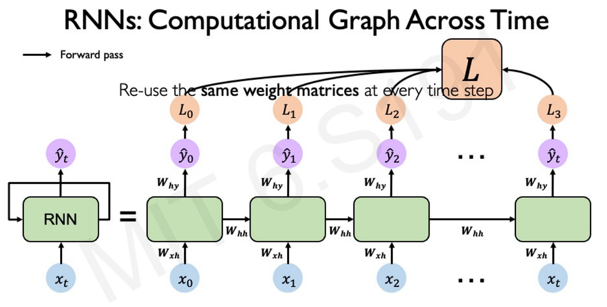
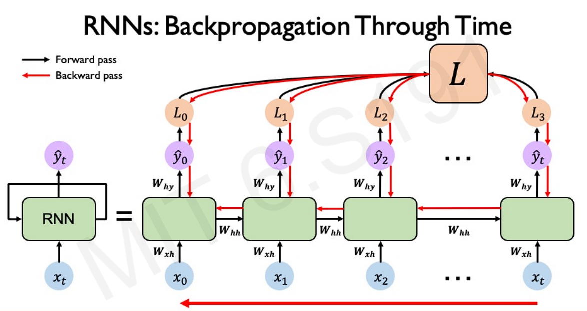
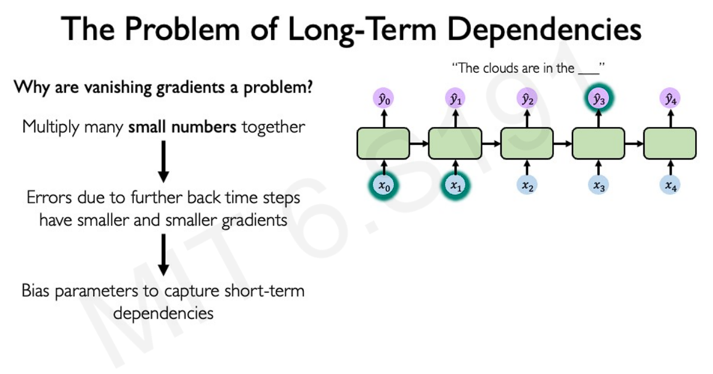

Given an image of a ball, how do we predict where it will go next? The traditional models we've seen previously in the previous part don't have any notion of sequence. Hence, even if we try to use the feedforward network models we've seen previously on a timeseries data, they would treat the data points as a slice of data in a particular timestamp, and wouldn't be able to capture the sequential nature.

The sequential feature can be captured by introducing another set of hidden states to maintain prior history, as we move through the sequence. The primary objective of these hidden states is to serve as a previous memory, updating with each timestamp input. These are also called recurrence relations, and the network is called **Recurrent Neural Network**. 

Compute the loss of the network at the individual slice, and then the total loss by summing over all the timestamps in our sequence. 

#### Design criteria of sequence models:
- Handle variable-length sequence
- Track long-term dependencies (something at the very beginning dictates something at the very end)
- Maintain information about the order
- Share parameters across sequences

Real-life example: Predict the next word

#### Encoding language for a Neural Network:
- Create a vocabulary of all possible words/sub-words
- Map each word into an index, so that the Neural network can be trained on a series of numerical values
- Embedding: transform indexes into a vector of fixed size
   - Neural networks are trained to embed indexes in a fixed-dimensional space, so that similar words are placed together

In order to handle the time-dependence, the backpropagation algorithm also needs to aggregate the loss over the individual time slices. This is also known as Backpropagation Through Time.

The issue with this type of backpropagation algorithm:
- **Exploding gradients**: where many of the gradients have values > 1
- **Vanishing gradients**: where many of the gradients have values < 1

One way to handle the issue of exploding and vanishing gradients is to use gates to selectively add or remove information within each recurrent unit. 

#### Limitations of RNN:
- Slow, no parallelism
- Not long memory

### References:
1. [MIT 6.S191: Recurrent Neural Networks, Transformers, and Attention](https://www.youtube.com/watch?v=GvezxUdLrEk&list=PLtBw6njQRU-rwp5__7C0oIVt26ZgjG9NI&index=2)
