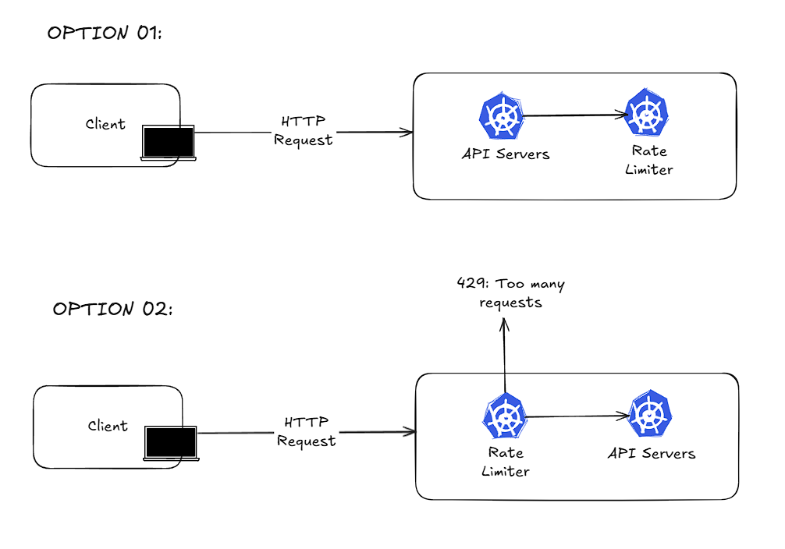
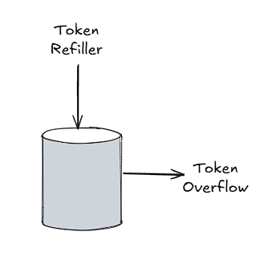
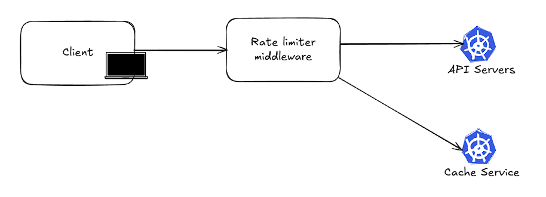
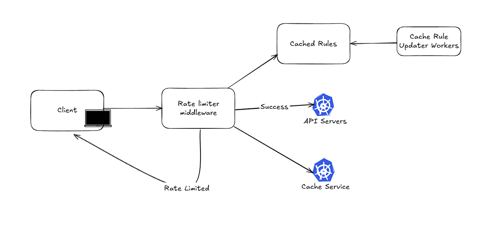

Rate limiter is a vital component in large-scale web applications, as it controls traffic to the application servers to ensure a smooth experience for the majority of the users. It has become a critical component due to the rise in DDoS attacks, and it also helps limit computationally intensive operations for users.

### Requirements
- Low latency: The rate-limiting component shouldn't slow down the HTTP response
- Memory footprint should be minimal to accommodate a large number of concurrent requests
- Distributed rate limiting
- Exception Handling: Show proper response message for rate-limited requests
- High Fault tolerance: The requests shouldn't fail in case the rate-limiting component fails

### Draft Design

##### Where to put the rate limiter?
- **Client-side:** Generally, client requests can be easily tampered with and bypassed, so it's better not to place an important component like rate-limiting on the client side
- **Server-side:** 

##### Rate-limiting Algorithm
There are several rate-limiting algorithms, such as Token-bucket and leaking bucket. However, here we discuss specifically the token bucket algorithm only, as it's the most commonly used one.

It involves two parameters:
- **Bucket size**: A bucket is maintained for each type of request of each user. The bucket size represents the number of maximum tokens allowed in the bucket. Each request consumes a token from the bucket, and if there are no tokens left in the bucket, then the request is rejected.
- **Refill rate**: number of tokens put into the bucket every unit time.

Using a database to store the token bucket-specific parameter isn't advisable, as it requires disk access. Instead, it would be better to use an in-memory cache.

### Detailed Design

##### Handling Race Condition
Locks on the whole system generally slow down the system.
Redis provides an alternative way to achieve atomicity through Lua scripting, where the Lua script is executed atomically on the server side. This is a common way to perform checks on Redis, as the scripts for the token bucket are executed ideally within 0.3 ms.

##### Synchronization
It's recommended to use a centralized cache data store; otherwise, synchronization between cache service deployments is a difficult task. Generally, the synchronization is achieved in eventual consistency.

##### Cloud Service Provider Offerings
All the prominent cloud service providers offer cache service. AWS offers ElastiCache, which internally uses Redis, and Azure also provides a similar offering through Azure Cache. GCP offers Memorystore service for both Memcached and Redis.

### References
1. [Should I rate-limit packets with iptables?](https://serverfault.com/questions/340256/should-i-rate-limit-packets-with-iptables)
2. [Rate Limit Requests with Iptables](https://blog.programster.org/rate-limit-requests-with-iptables)
3. [Scaling your API with rate limiters](https://stripe.com/blog/rate-limiters)
4. [Scaling your API with rate limiters](https://gist.github.com/ptarjan/e38f45f2dfe601419ca3af937fff574d)
5. [Better Rate Limiting With Redis Sorted Sets](https://engineering.classdojo.com/blog/2015/02/06/rolling-rate-limiter/)
6. [How we built rate limiting capable of scaling to millions of domains](https://blog.cloudflare.com/counting-things-a-lot-of-different-things/)
7. [Lua scripting in Redis for performance gain](https://blog.devgenius.io/lua-scripting-in-redis-for-performance-gain-6ca3970a9125)
8. [Rate Limiting using Redis + Golang](https://irshitmukherjee55.hashnode.dev/rate-limiting-using-redis-golang-token-bucket-algorithm)
9. [Atomicity with Lua](https://redis.io/learn/develop/java/spring/rate-limiting/fixed-window/reactive-lua)
10. [Ratelimit code opensourced by Lyft](https://github.com/pusher/lyft-ratelimit)
11. [Announcing Ratelimit : Go/gRPC service for generic rate limiting](https://eng.lyft.com/announcing-ratelimit-c2e8f3182555)
12. [Amazon ElastiCache](https://aws.amazon.com/elasticache)

