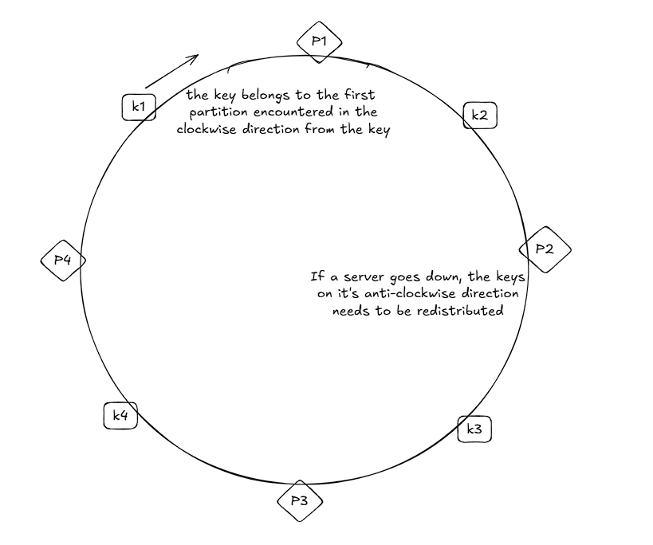

Hashing is one of the most crucial concepts, and has found usage in multiple unconventional places. The distributed systems use hashing to distribute the requests efficiently and evenly across servers. 

##### Rehashing problem

Suppose we've a hash function which evenly distributes the keys among n servers. Now what happens if one of the servers goes down? Most clients will try to connect to the wrong server, and the request will fail. The critical question is how to effectively mitigate this problem when one of the servers goes down.

Consistent hashing is a commonly used technique for this rehashing problem, as only k/n keys need to be remapped on average, where k is the number of keys and n is the number of servers.

##### Hash ring and consistent hashing

All the cryptographic hashes used have a mathematical lower and upper value. For example, SHA-1 has a lower bound of 0 and an upper bound of 2^160-1. Logically, a hash ring can be thought of as a ring by connecting both ends of the possible values of the cryptographic hash. 

The consistent hashing works based on the following two principles:
- Map servers and keys to the ring using a uniformly distributed hash function
- To find out which server a key is mapped to, go clockwise from the key position until the first partition on the ring is found

##### Virtual node

A virtual node refers to a partition on the hash ring, and each server is responsible for multiple partitions. If one node goes down, then the partitions present on that node need to be redistributed.
 

