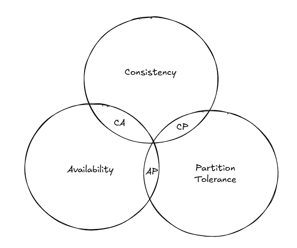

A key-value store, also referred to as a key-value database, is a crucial topic to discuss in system design. Designing a large-scale key-value store addresses a vast majority of the issues that arise in system design, and even a slight change in the requirements of such a key-value store can lead to a completely different design. In this wiki, we will discuss a couple of issues regarding designing a key-value store, and how these are resolved in general.

### Requirements:
- Ability to store big data
- High availability
- High scalability
- Automatic scaling
- Tunable consistency
- Low latency

### CAP Theorem:

**Consistency**: All the clients should see the same data, no matter which server they connect to
**Availability**: The clients should get a response, even if the majority of the servers are down
**Partition Tolerance**: Partition tolerance signifies that in case the servers are partitioned due to a network issue, i.e., communication breaks between 2 nodes, the system should continue to operate

CAP Theorem suggests that distributed systems can satisfy two of the above three properties, not all three of them.

It's worth noting that distributed systems must be partition-tolerant. Thus, the distributed systems can either be a CP (Consistent & Partition Tolerance) system or an AP (Availability & Partition Tolerance) system. A CA (Consistent & Availability) distributed system is of no use. The type of system we want to design depends on the use case. For example, the banking sector requires strict consistency systems.

### Core Components:
- Data partition
- Data replication
- Consistency
- Inconsistency resolution
- Handling Failures
- System architecture diagram

##### Data partition:
Split the data into multiple partitions and store them across servers. Consistent hashing is generally used to distribute data across multiple servers.

##### Data replication:
To achieve high availability and reliability, data needs to be replicated across multiple servers. Generally, the data is replicated asynchronously.

Once a key is mapped to a position on the hash ring, walk clockwise from that position and choose the first *N* partitions to replicate the same data.  Only select unique servers while performing the clockwise walk from the key on the hash ring in the consistent hashing mechanism.

##### Consistency:

Since data is replicated at multiple nodes, it must be synchronized across the nodes to guarantee consistency.

The following parameters are used to define **quorum consensus**.

**N**: The number of replicas or servers in the system
**W**: Write quorum size. A write operation is marked as successful only if it's replicated across at least W replicas.
**R**: Read quorum size. A read operation must wait until the client receives a response from at least R replicas.

Strong consistency is guaranteed only if *W+R > N*, as this ensures there must be at least one overlapping node with the latest data to enforce consistency.

These types of systems can handle loss of *N – min(W, R)* replicas.

**Consistency models**
- Strong consistency: Any read operation either returns the most recent update or returns failure
- Weak consistency: Read operations mayn't see the most recent update
- Eventual consistency: This is a subset of weak consistency, where the updates are propagated to all the nodes, and they will get synced eventually

##### Inconsistency resolution:
Versioning and vector clocks are used to detect inconsistency. We need to explore specific research papers to understand how different KV stores employ vector clocks.

##### Handling failures:

**Failure detection:**
The gossip protocol is generally followed 

**Handling temporary failures:**

Sloppy Quoram: A flexible quorum technique, where read and writes are performed on any of the available nodes, i.e., write is performed on reachable W servers, and read is performed from reachable R servers.

Hinted Handoff: If a server is offline, another server processes the requests temporarily. Once the server is up, the changes are pushed to the node.

**Handling permanent failures:**
Data is migrated from a healthy node to a new node. Migration is performed on different layers. In the later phases of migration, anti-entropy protocols are used to keep the new node synced with the replica. Multiple mechanisms exist that internally utilize the *Merkle tree* to perform this type of migration.

##### System architecture diagram

### Future study:
- How a vector clock is used to detect and resolve inconsistency

