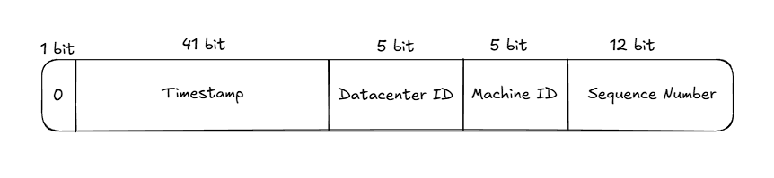

In this wiki, we will explore how various services generate unique IDs. 

### Requirements:
- Characteristics of the unique ID required
    - IDs must be unique and sortable
    - IDs created later must be larger than those created previously
    - ID should have only numerical value
    - IDs should fit into 64-bit

- System requirements
    - System should be able to generate at least 10000 IDs per second 

### Alternative ways to generate Unique ID

##### UUID

UUID is a simple way to generate unique IDs. There are different versions of UUID, however, all of them take 128 bits if encoded and stored directly in binary format. 

It can be assumed to be a fairly unique ID generator, though there's a small probability of conflict. Assuming that the internal random number generation logic does not have any bugs, especially related to the seeding value, the Wikipedia documentation suggests that there's a 50% probability of at least one collision if 2.71 quintillion version-4 UUIDs are generated. This number is so large that it's equivalent to generating 1 billion UUIDs per second for about 86 years.

Due to the nature of UUIDs, multiple web servers can be used in parallel to generate UUIDs, and have seen usage in many micro-services.


The drawback with this approach is that it requires more space in the database. Ideally, the UUIDs are supposed to take 128 bits if stored in binary encoded format; however, it's generally preferred to store them as characters to have proper readability.

This might not be suitable for the above use case, as UUIDs are not easily sortable and cannot be stored within 64 bits.


##### Ticket Server

Ticker server is another way of generating unique numbers by utilizing the auto_increment feature of databases. The principle of this approach lies in using a few server ticket servers to communicate with a separate database system, responsible for generating unique IDs.


DDL of a ticket table:
```sql
CREATE TABLE `Tickets64` (
  `id` bigint(20) unsigned NOT NULL auto_increment,
  `stub` char(1) NOT NULL default '',
  PRIMARY KEY (`id`),
  UNIQUE KEY `stub` (`stub`)
) ENGINE=InnoDB
```

Query to fetch the latest generated ID:
```sql
REPLACE INTO Tickets64 (stub) VALUES ('a');  -- Always 'a'
SELECT LAST_INSERT_ID();
```

Even though the above architecture diagram shows the use of a single ticket server, it's worth noting that multiple ticket servers can be used by specifying different increment and offset values. 


```
-- TicketServer1 (Odd numbers)
auto-increment-increment = 2
auto-increment-offset = 1

-- TicketServer2 (Even numbers) 
auto-increment-increment = 2
auto-increment-offset = 2
```

The drawback of this approach is that the ticket server database is a single point of failure.


##### Twitter Snowflake Approach

A divide-and-conquer approach is taken to generate the unique ID.



Sign bit: It's always set to 0, reserved for future use.
Timestamp: Milliseconds since the epoch of choice
Datacenter ID: Can support up to 2^5=32 datacenters
Machine ID: Can support up to 2^5=32 machines per datacenter
Sequence Number: This number is reset in every millisecond, and incremented by 1 when a new sequence number is generated

Datacenter ID and Machine ID are allocated beforehand, as any change in them might cause conflict with existing IDs.

Network Time Protocol (NTP) is generally used to synchronize time over the datacenter network. 


### References:
1. [https://news.ycombinator.com/item?id=36900641](Ever see a UUID collision?)
2. [https://en.wikipedia.org/wiki/Universally_unique_identifier](Universally unique identifier)
3. [https://blog.x.com/engineering/en_us/a/2010/announcing-snowflake](Announcing Twitter Snowflake)
4. [https://www.reddit.com/r/programming/comments/cajap/twitter_announces_snowflake_a_distributed_unique/](Twitter announces Snowflake, a distributed unique ID generator)
5. [https://planetscale.com/blog/the-problem-with-using-a-uuid-primary-key-in-mysql](The Problem with Using a UUID Primary Key in MySQL)
6. [https://en.wikipedia.org/wiki/Network_Time_Protocol](Network Time Protocol)
7. [https://www.youtube.com/watch?v=BAo5C2qbLq8](Network Time Protocol (NTP) - Computerphile)
