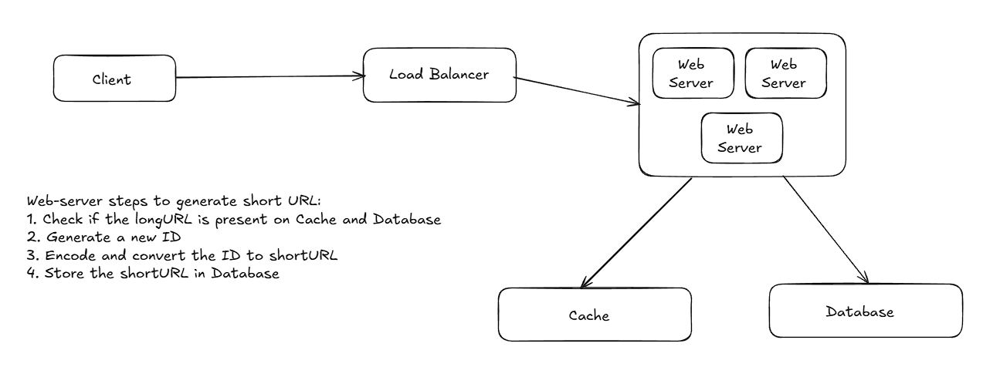

In this wiki, we will explore an approach to design a URL shortener service.

### Requirements:
- Shortened URLs' length should be as short as possible
- Shortened URL should contain only ASCII characters
- Shortened URLs are not updated
- System should have high availability, scalability, and fault-tolerance

##### Back of the envelope estimation:
- Write operations: 100 million URLs generated per day => 1160 operations/sec
- Read operations: Assuming a ratio of read operations to write operations to be 10:1, read operations ~11600 operations/sec
- Assuming service would run for 10 years: 100 million * 365 * 10 => 365 billion records
- Assuming average URL length of 100 bytes, storage requirement: 365 billion * 100 bytes => 36.5 PB

### API endpoints:

POST api/v1/shorten
- request payload: {longUrl: string}

GET api/v1/shortUrl
- Return the long URL for HTTP redirection
- Response status code of 301 redirect for permanent redirect: Browser caches the redirection response
- Response status code of 302 redirect for temporary redirect: Used for analytical purposes, where the server needs to be aware of every query

### High-level diagram:

