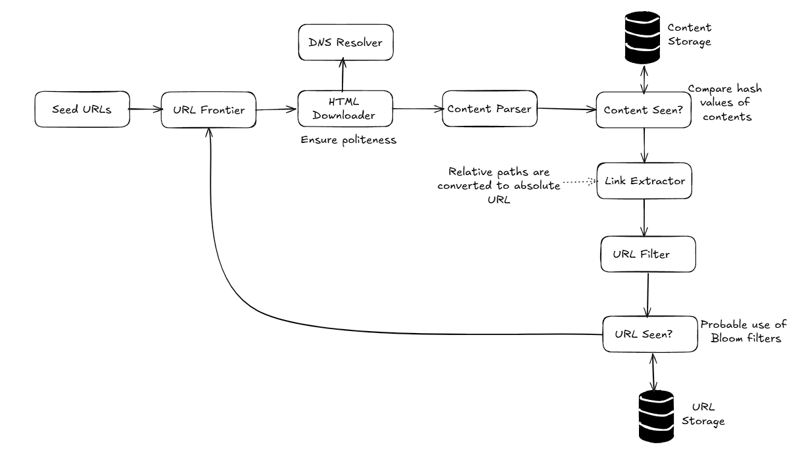
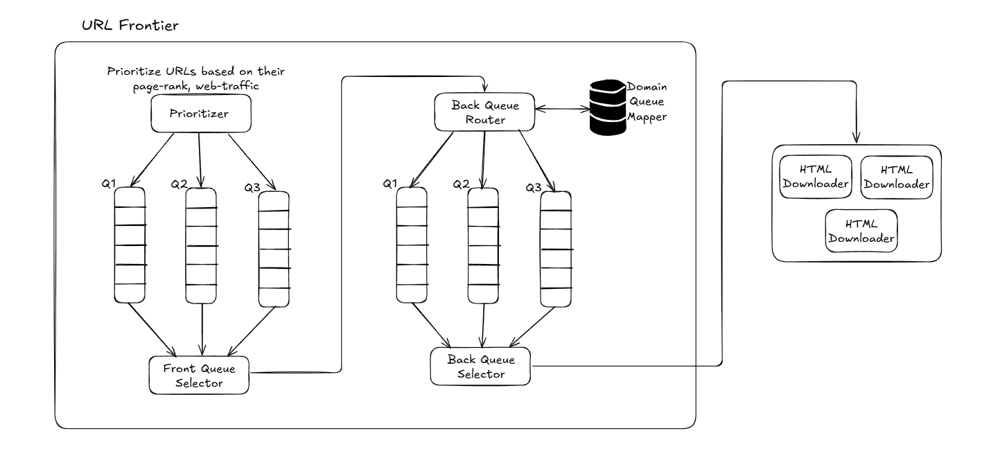

In this wiki, we will explore an approach to designing a Web-crawling service.

### Requirements
- What is the purpose of the crawler here? Search engine indexing, data mining, or for some other purpose? => Search engine indexing
- Type of content that needs to be parsed: HTML/ Text/ PDF/ Image/ Video => HTML only
- How long do we need to store the parsed content? => 5 years
- How do we handle a web page that is edited? => Web-page is parsed only once
- Scale of web-crawling? => 1 billion pages per month
- Robustness: Need to handle the edge cases while handling web pages, including non-responsiveness, web server crashing, bad HTML, etc.
- Politeness: Shouldn't make too many requests to a website within a short span of time. The service can get marked as a DoS attacker.
- Extensibility: Flexible enough to support parsing new content types with minimal changes

##### Back of the envelope estimation:
- 1 billion web pages to be downloaded each month
- QPS => 1 billion pages / 30 days / 24 hours / 3600 seconds => ~400 pages/second
- Peak QPS = 2 * QPS => 800
- Assume the average web page size is 500k
- Storage requirement = 1 billion page/month * 500k => 500TB/month
- Total Storage requirement = 500 TB * 12 months * 5 years => 30 PB

### Architecture

**Spider Trap**: Causes the crawler to loop in an infinite loop. Need to handle such edge cases.

### Future Study:
- How to know a webpage is edited? Any optimization regarding this?
- How are bloom filters and hash values used? Check examples
