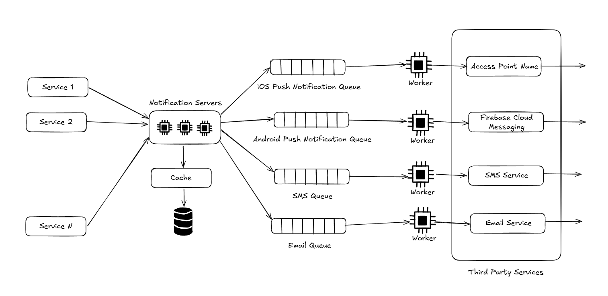

In this wiki, we will explore an approach to designing a notification service.

### Requirements
- What type of notifications do we need to send? => Push, SMS, email
- Real-time system? => Soft real-time system. In case of high load, a slight delay is tolerable
- Supported devices? => iOS devices, Android devices, laptops, and desktops
- Who triggers notification => Any service, authenticated
- Opt-out feature? => Available to the users

##### Back of the envelope estimation:
- 10 million mobile push notifications, 1 million SMS, and 5 million Email notifications

### Architecture

**Tracking:**
- Monitor queued notifications
- Track failure events

### Future Study:
- How JWT authentication is used?
- How to deduplicate notifications?
