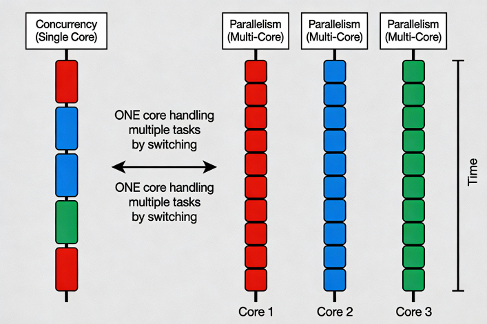
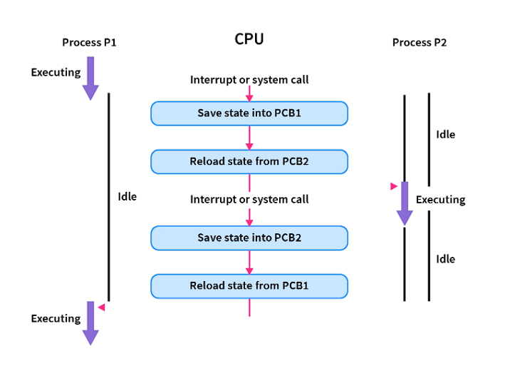
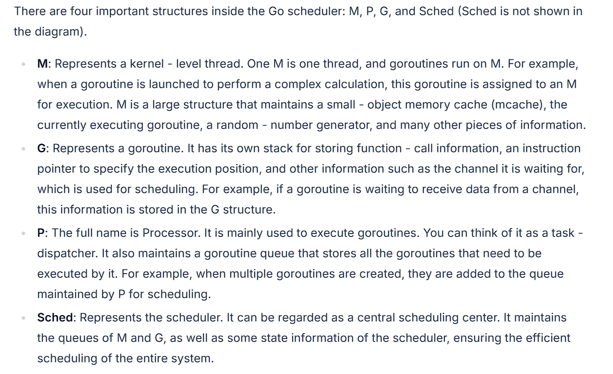
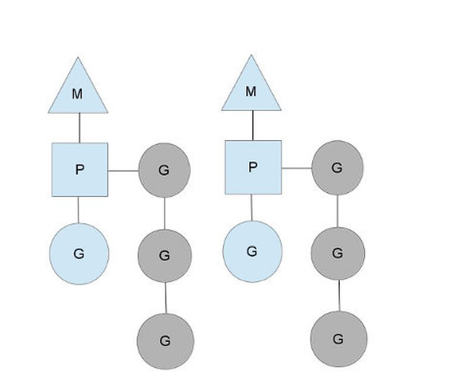

Concurrency and Paralleism - these terms sound similar; however, from a software engineer's perspective, they denote two different concepts.

**Concurrency** is the ability of a system to perform multiple tasks simultaneously or in an overlapping fashion. A concurrent system can work on multiple tasks at a given time. **Parallelism** is a special case of concurrency in which multiple tasks are executed simultaneously. A system can be concurrent without being parallel; it can switch between the processes quickly to provide an illusion of simultaneous execution. This is known as time-slicing or interleaving.




**Multiprocessing** is a specific approach to parallelism that uses multiple processors or cores within a single system. Parallelism is a more general concept that refers to executing multiple tasks or computations simultaneously across different processing units or resources, whether within a single system or across multiple systems.


### Context Switch

The above discussion of concurrency and parallelism is theoretical. However, as application developers, we're more interested in the practical aspects of concurrency and parallelism and need to understand how they impact the tasks executed and, ultimately, the application level.

Context switching is the mechanism for storing the state of the currently executing task so it can be paused and resumed later. Context switching is one of the core mechanisms for supporting concurrency and parallelism. Each context switch incurs some overhead, depending on the task type.


### Context Switching Cost Hierarchy
Context-switch overhead varies dramatically by level of abstraction: process switches are the most expensive, thread switches are moderately expensive, and goroutine switches are the cheapest.
​

##### Process Context Switch Cost
Process context switches are the most expensive; at a typical CPU frequency of 3 GHz, this translates to approximately 8,000-16,000 CPU instructions per context switch.



The high cost comes from the extensive operations required:
​- Saving and restoring complete process state (registers, program counter, stack pointer)
- Switching virtual memory address spaces (updating page tables, MMU registers)
- Complete TLB flush—all cached virtual-to-physical address translations become invalid
​- L1, L2, L3 cache pollution as the new process's memory footprint displaces the previous process's data
​- Operating system kernel involvement for scheduling decisions

##### Thread Context Switch Cost
Thread context switches within the same process are significantly cheaper, at **~10-50% faster** than process switches.

Threads are faster because they share the same address space:
​- No virtual memory space switching required
- No TLB flush—address translations remain valid
​- Shared L1/L2/L3 cache data reduces cache miss rates
- Less kernel state to save/restore
- Same page tables and memory mappings

However, thread switches still involve significant overhead from CPU register saves/restores, kernel scheduler invocation, and partial cache disruption.
​

##### Coroutine Context Switch Cost
Coroutine context switches operate at the application level in user space and are **10-25x faster than OS thread switches and 13- 27x faster than process switches**.​

The dramatic efficiency comes from:
​- User-space scheduling: No kernel involvement, no system calls, no user-to-kernel mode transitions
- Minimal state: Only save/restore a few registers and stack pointer—not full CPU state
- Cooperative scheduling: Coroutines yield at known safe points (channel operations, syscalls), simplifying state management
- Shared memory: Coroutines on the same OS thread share stack and heap without synchronization overhead
- Small stack: 2-8KB vs 1MB for OS threads means less memory to manage during switches


### AsynIO and Event Loop

**Asynchronous I/O** is a programming model that allows a program to initiate I/O operations without blocking execution while they complete. When a task issues an I/O request (such as a network call or a disk read), it yields control back to the program rather than blocking, allowing other tasks to execute freely. The program later re-runs the paused task once its I/O request completes.

The **event loop** is the core runtime mechanism that enables asynchronous programming. It continuously monitors a queue of tasks and executes associated callback functions when events of interest occur.
​

##### How the Event Loop Works
The event loop operates in phases:
​- Waiting State: The loop blocks on a system call (like epoll_wait on Linux, kqueue on macOS, or IOCP on Windows) that monitors multiple file descriptors or sockets
​- Event Detection: When an I/O operation completes, the OS notifies the event loop that a resource is ready
​- Callback Execution: The event loop retrieves the registered callback from the callback queue and executes it
​- Repeat: The loop returns to the waiting state for the next event
​
This non-blocking I/O approach allows a single-threaded program to efficiently handle thousands of concurrent connections.


### GMP model in Go

Go runtime uses an interesting scheduler that maps multiple coroutines to OS threads in an M:N relationship, thus leveraging the benefits of asynchronous programming discussed above in a multi-thread environment.

Code example of goroutine:
```go
package main

import (
    "fmt"
    "sync"
)

func cal(a int, b int, n *sync.WaitGroup) {
    c := a + b
    fmt.Printf("%d + %d = %d\n", a, b, c)
    // When the goroutine is completed, call the Done method to decrease the count of WaitGroup by 1
    defer n.Done()
}

func main() {
    var go_sync sync.WaitGroup // Declare a WaitGroup variable
    for i := 0; i < 10; i++ {
        // Increase the count of WaitGroup by 1 before starting the goroutine
        go_sync.Add(1)
        go cal(i, i + 1, &go_sync)
    }
    // Block and wait until the count of WaitGroup is 0, that is, all goroutines are completed
    go_sync.Wait()
}
```

##### Goroutine Scheduling Model





```go
runtime.schedule() {
    // only 1/61 of the time, check the global runnable queue for a G.
    // if not found, check the local queue.
    // if not found,
    //     try to steal from other Ps.
    //     if not, check the global runnable queue.
    //     if not found, poll network.
}
```

More details on the go runtime scheduling can be read [here](https://www.ardanlabs.com/blog/2018/08/scheduling-in-go-part2.html).


### References
1. [A Deep Dive into Concurrency, Parallelism, Multiprocessing, and Distributed Systems-Part-1-Introduction](https://www.thetechcruise.com/a-deep-dive-into-concurrency-parallelism-multiprocessing-and-distributed-systems-part-1-introduction)
2. [Concurrency vs. Parallelism – Key Differences Explained](https://getsdeready.com/concurrency-vs-parallelism-key-differences-explained/)
3. [Concurrency and Parallelism in Large-Scale Systems](https://www.linkedin.com/pulse/concurrency-parallelism-large-scale-systems-farid-el-aouadi-apmze/)
4. [How long does it take to make a context switch?](https://blog.tsunanet.net/2010/11/how-long-does-it-take-to-make-context.html)
5. [Goroutines, OS Threads, and the Go Scheduler — A Deep Dive That Actually Makes Sense](https://dev.to/arundevs/goroutines-os-threads-and-the-go-scheduler-a-deep-dive-that-actually-makes-sense-1f9f)
6. [Go's Concurrency Decoded: Goroutine Scheduling](https://leapcell.io/blog/gos-concurrency-decoded-goroutine-scheduling)
7. [Gist of Go: Concurrency internals](https://antonz.org/go-concurrency/internals/)
8. [Scheduling In Go : Part II - Go Scheduler](https://www.ardanlabs.com/blog/2018/08/scheduling-in-go-part2.html)
9. [Python behind the scenes #12: how async/await works in Python](https://tenthousandmeters.com/blog/python-behind-the-scenes-12-how-asyncawait-works-in-python/)

