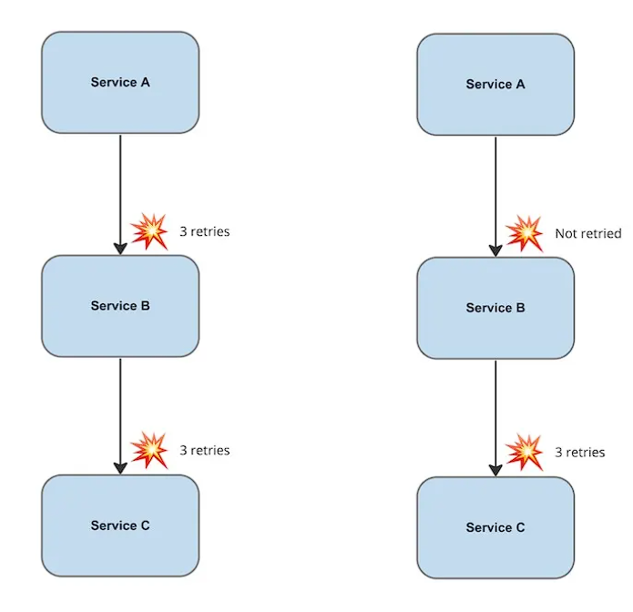
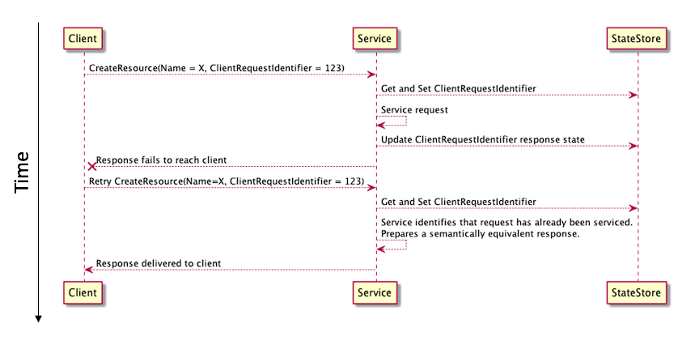
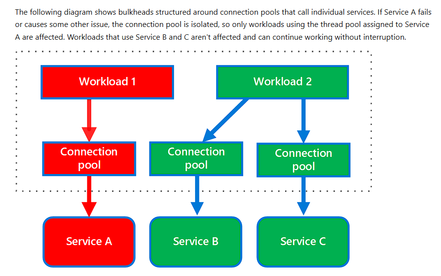

Distributed systems consist of a set of loosely coupled services that end users perceive as a single coherent system. However, due to the loose coupling between components and communication over the network, failures are inevitable. Network congestion, a few instances going down, there can be a multitude of reasons that failure can be introduced in the system.


### Timeout Management

Each retry attempt should have a reasonable timeout to prevent hanging indefinitely.

Without proper request timeouts, the service would consume excessive resources. For example, 100 requests per second, each using around 200 KB of memory, can accumulate ~1GB of memory to serve inflight requests. From the above example, if the timeout isn't used appropriately, the service could run into out-of-memory issues pretty soon.

It's also worth noting that the underlying work on abandoned requests should be canceled once the timeout is hit. Otherwise, the benefit of relinquishing resources will not take place.

A good metric for choosing the timeout value is the latency of the downstream service. Choose an acceptable rate of false timeout (0.01%). We also need to note the latency for both **p99.9** and **p50**. If their latencies are similar, it's better to pad the timeout value to avoid a small latency change causing high timeouts.


```go
package main

import (
    "context"
    "fmt"
    "log"
    "net/http"
    "time"
)

// Basic timeout middleware
func TimeoutMiddleware(timeout time.Duration) func(http.Handler) http.Handler {
    return func(next http.Handler) http.Handler {
        return http.HandlerFunc(func(w http.ResponseWriter, r *http.Request) {
            ctx, cancel := context.WithTimeout(r.Context(), timeout)
            defer cancel()
            
            // Create channel to signal completion
            done := make(chan struct{})
            
            // Run handler in goroutine
            go func() {
                next.ServeHTTP(w, r.WithContext(ctx))
                close(done)
            }()
            
            // Wait for either completion or timeout
            select {
            case <-done:
                return
            case <-ctx.Done():
                w.WriteHeader(http.StatusGatewayTimeout)
                w.Write([]byte("Request timeout"))
            }
        })
    }
}

// Handler that respects context timeout
func slowHandler(w http.ResponseWriter, r *http.Request) {
    ctx := r.Context()
    
    // Simulate slow operation
    select {
    case <-time.After(3 * time.Second):
        w.Write([]byte("Operation completed"))
    case <-ctx.Done():
        // Context cancelled/timeout - stop processing
        log.Println("Request timeout:", ctx.Err())
        return
    }
}

// Handler with database query example
func databaseHandler(w http.ResponseWriter, r *http.Request) {
    ctx := r.Context()
    
    // Pass context to database queries
    // rows, err := db.QueryContext(ctx, "SELECT * FROM users")
    // if err != nil {
    //     if ctx.Err() == context.DeadlineExceeded {
    //         log.Println("Database query timeout")
    //         return
    //     }
    //     // Handle other errors
    // }
    
    // Simulate work
    for i := 0; i < 10; i++ {
        select {
        case <-ctx.Done():
            log.Println("Context cancelled, stopping work")
            return
        default:
            time.Sleep(500 * time.Millisecond)
            fmt.Printf("Processing step %d\n", i+1)
        }
    }
    
    w.Write([]byte("Database operation completed"))
}

func main() {
    mux := http.NewServeMux()
    
    // Apply timeout middleware
    mux.Handle("/slow", TimeoutMiddleware(2*time.Second)(http.HandlerFunc(slowHandler)))
    mux.Handle("/db", TimeoutMiddleware(5*time.Second)(http.HandlerFunc(databaseHandler)))
    mux.HandleFunc("/fast", func(w http.ResponseWriter, r *http.Request) {
        w.Write([]byte("Fast response"))
    })
    
    log.Println("Server starting on :8080")
    log.Fatal(http.ListenAndServe(":8080", mux))
}

```

For more examples, please check [here](https://leapcell.io/blog/mastering-go-context-for-robust-concurrency-patterns).


### Retries

Follow a strategy to avoid **thundering herds**, where the calls that failed at almost the same time are retried almost at the same time. Utilize **exponential backoff** and **jitter**. Exponential backoff, to wait longer on every retry, giving more time to recover to a potentially overloaded upstream, and jitter to introduce some randomness to avoid thundering herds.


###### Issues with retries:

- **Drop in throughput**: With a larger number of retries for the same request, the number of requests served by the server per unit of time gets reduced.
- **SLA violations**: Take SLA into account while setting retry count and timeout period
- **Retry sparingly**: Not all requests can or should be retried. The following status codes are perfect candidates for retry: 429, 500, 502, 503, and 504. However, status codes like 404 indicate client-side issues with request formation; hence, multiple retries wouldn't change the outcome.
- **Retriable operations**: Be aware of the potential side effects of the operation
- **Retry only on one level:**


- **Use Load shedding and backpressure**: Upstream service should shed any additional requests that it can't handle


##### Use Idempotent APIs to make retries safe

The majority of the HTTP requests are idempotent, except for POST and PATCH.
Incorporate a unique caller-provided **client request identifier** into the API contracts. Requests from the same caller with the same client request identifier can be considered duplicates and handled accordingly.




##### Database Design Adjustments (Upsert Operation)

Prefer to **use upsert operations** (which update a record if it exists or insert it if it doesn't) or apply unique constraints that prevent duplicates from being added in the first place.

##### Idempotency in Messaging Systems

Idempotency can be enforced by storing a log of processed message IDs and checking each incoming message against it.


### Failover Caching
Most of these outages are temporary. Thanks to self-healing and advanced load balancing, we should be able to keep our service running during these glitches. This is where failover caching can help and provide the necessary data to our application.

Only use failover caching when it serves the outdated data better than nothing.


### Circuit Breaker Pattern

The Circuit Breaker pattern prevents an application from performing an operation that's likely to fail. A circuit breaker acts as a proxy for operations that might fail. The proxy should monitor the number of recent failures and use this information to decide whether to allow the operation to proceed or to return an exception immediately.

A circuit breaker consists of the following three states:
- **Closed**: The request is routed to the upstream service without any hindrance
- **Open**: The request failed immediately without invoking the upstream service
- **Half-Open**: A limited number of requests are allowed to invoke the upstream service

The retry logic should be sensitive to any exceptions that the circuit breaker returns and stop retry attempts if the circuit breaker indicates that a fault isn't transient.

Service meshes often support circuit breaking as a sidecar or as a standalone capability without modifying application code.

```go
package main

import (
	"github.com/sony/gobreaker"
)

type ResilientPaymentClient struct {
	service        *PaymentService
	circuitBreaker *gobreaker.CircuitBreaker
}

func NewResilientPaymentClient(service *PaymentService) *ResilientPaymentClient {
	// Configure circuit breaker
	settings := gobreaker.Settings{
		Name: "PaymentService",
		// Maximum requests allowed in half-open state before deciding to close
		MaxRequests: 2,
		// Time period after which failure counts reset in closed state
		Interval: 10 * time.Second,
		// Time to wait before attempting half-open state
		Timeout: 5 * time.Second,
		// Function to determine when circuit should trip open
		ReadyToTrip: func(counts gobreaker.Counts) bool {
			failureRatio := float64(counts.TotalFailures) / float64(counts.Requests)
			return counts.Requests >= 3 && failureRatio >= 0.6
		},
		// Callback for state transitions (useful for monitoring)
		OnStateChange: func(name string, from gobreaker.State, to gobreaker.State) {
			log.Printf("[CIRCUIT BREAKER] %s: State changed from %s to %s", 
				name, from.String(), to.String())
		},
	}

	return &ResilientPaymentClient{
		service:        service,
		circuitBreaker: gobreaker.NewCircuitBreaker(settings),
	}
}

func (r *ResilientPaymentClient) ProcessPayment(ctx context.Context, amount float64) (string, error) {
	// Execute through circuit breaker
	result, err := r.circuitBreaker.Execute(func() (interface{}, error) {
		return r.service.ProcessPayment(ctx, amount)
	})
	
	if err != nil {
		return "", err
	}
	
	return result.(string), nil
}
```


### Load shedding and Backpressure

```go
type LoadShedder struct {
	maxConcurrent   int64
	currentLoad     atomic.Int64
	cpuThreshold    float64
	dropProbability atomic.Value // stores float64
}

func NewLoadShedder(maxConcurrent int, cpuThreshold float64) *LoadShedder {
	ls := &LoadShedder{
		maxConcurrent: int64(maxConcurrent),
		cpuThreshold:  cpuThreshold,
	}
	ls.dropProbability.Store(0.0)
	
	// Background goroutine to monitor system load
	go ls.monitorSystemLoad()
	
	return ls
}

// Monitor CPU and adjust drop probability
func (ls *LoadShedder) monitorSystemLoad() {
	ticker := time.NewTicker(1 * time.Second)
	defer ticker.Stop()
	
	for range ticker.C {
		// Get current CPU usage (simplified - in production use actual metrics)
		numGoroutines := runtime.NumGoroutine()
		cpuUsage := float64(numGoroutines) / 1000.0 // Simulated CPU usage
		
		// Calculate drop probability based on load
		var dropProb float64
		if cpuUsage > ls.cpuThreshold {
			// Linear increase from threshold to 100%
			dropProb = (cpuUsage - ls.cpuThreshold) / (1.0 - ls.cpuThreshold)
			if dropProb > 0.9 {
				dropProb = 0.9 // Never drop more than 90%
			}
		}
		
		ls.dropProbability.Store(dropProb)
		
		if dropProb > 0 {
			log.Printf("[LOAD SHEDDER] System overloaded. Goroutines: %d, Drop probability: %.2f%%",
				numGoroutines, dropProb*100)
		}
	}
}

// ShouldAcceptRequest decides whether to accept or reject a request
func (ls *LoadShedder) ShouldAcceptRequest() bool {
	// Check 1: Hard limit on concurrent requests
	current := ls.currentLoad.Load()
	if current >= ls.maxConcurrent {
		log.Println("[LOAD SHEDDER] ❌ Rejected: Max concurrent limit reached")
		return false
	}
	
	// Check 2: Probabilistic rejection based on system load
	dropProb := ls.dropProbability.Load().(float64)
	if dropProb > 0 && rand.Float64() < dropProb {
		log.Printf("[LOAD SHEDDER] ❌ Rejected: Probabilistic shedding (%.0f%% drop rate)", 
			dropProb*100)
		return false
	}
	
	return true
}

// Acquire increments the load counter
func (ls *LoadShedder) Acquire() {
	ls.currentLoad.Add(1)
}

// Release decrements the load counter
func (ls *LoadShedder) Release() {
	ls.currentLoad.Add(-1)
}
```


### Bulkhead Pattern

Partition service instances into different groups, based on **consumer load and availability requirements**. This design helps to isolate failures, and allows you to sustain service functionality for some consumers, even during a failure.



```go

// Bulkhead represents a resource pool with limited capacity
type Bulkhead struct {
	name      string
	semaphore chan struct{} // Acts as a token bucket
	maxWorkers int
	timeout    time.Duration
	mu         sync.Mutex
	activeCount int
}

// NewBulkhead creates a new bulkhead with specified capacity
func NewBulkhead(name string, maxWorkers int, timeout time.Duration) *Bulkhead {
	return &Bulkhead{
		name:       name,
		semaphore:  make(chan struct{}, maxWorkers),
		maxWorkers: maxWorkers,
		timeout:    timeout,
	}
}

// Execute runs a function within the bulkhead's resource limits
func (b *Bulkhead) Execute(ctx context.Context, fn func() error) error {
	// Try to acquire a permit (worker slot)
	select {
	case b.semaphore <- struct{}{}: // Acquired
		b.mu.Lock()
		b.activeCount++
		active := b.activeCount
		b.mu.Unlock()
		
		log.Printf("[%s] Acquired permit. Active workers: %d/%d", 
			b.name, active, b.maxWorkers)
		
		defer func() {
			<-b.semaphore // Release permit
			b.mu.Lock()
			b.activeCount--
			b.mu.Unlock()
			log.Printf("[%s] Released permit. Active workers: %d/%d", 
				b.name, b.activeCount, b.maxWorkers)
		}()
		
		// Execute the function
		return fn()
		
	case <-time.After(b.timeout):
		return fmt.Errorf("bulkhead %s: timeout waiting for available worker", b.name)
		
	case <-ctx.Done():
		return ctx.Err()
	}
}
```


### References
1. [The two friends of a distributed systems engineer: timeouts and retries](https://www.contentful.com/blog/the-two-friends-of-a-distributed-systems-engineer-timeouts-and-retries/)
2. [Mastering Exponential Backoff in Distributed Systems](https://betterstack.com/community/guides/monitoring/exponential-backoff/)
3. [Timeouts, retries, and backoff with jitter](https://aws.amazon.com/builders-library/timeouts-retries-and-backoff-with-jitter/)
4. [Retries Strategies in Distributed Systems](https://www.geeksforgeeks.org/system-design/retries-strategies-in-distributed-systems/)
5. [Making retries safe with idempotent APIs](https://aws.amazon.com/builders-library/making-retries-safe-with-idempotent-APIs/)
6. [Designing a Microservices Architecture for Failure](https://blog.risingstack.com/designing-microservices-architecture-for-failure/)
7. [Mitigating Downtime: Strategies for Building Resilient Microservices](https://www.buildpiper.io/blogs/mitigating-downtime-strategies-for-building-resilient-microservices/)
8. [Articulating graceful degradation strategies in architectural design](https://www.designgurus.io/answers/detail/articulating-graceful-degradation-strategies-in-architectural-design)
9. [Go Concurrency Patterns: Context](https://go.dev/blog/context)
10. [Go Concurrency Patterns: Pipelines and cancellation](https://go.dev/blog/pipelines)
11. [Container-aware GOMAXPROCS](https://go.dev/blog/container-aware-gomaxprocs)
12. [Bulkhead pattern](https://learn.microsoft.com/en-us/azure/architecture/patterns/bulkhead)
13. [How tech giants like Netflix built resilient systems with chaos engineering](https://sdtimes.com/softwaredev/how-tech-giants-like-netflix-built-resilient-systems-with-chaos-engineering/)
14. [Mastering Microservices Patterns: Circuit Breaker, Fallback, Bulkhead, Saga, and CQRS](https://dev.to/geampiere/mastering-microservices-patterns-circuit-breaker-fallback-bulkhead-saga-and-cqrs-4h55)
15. [Circuit Breaker pattern](https://learn.microsoft.com/en-us/azure/architecture/patterns/circuit-breaker)
