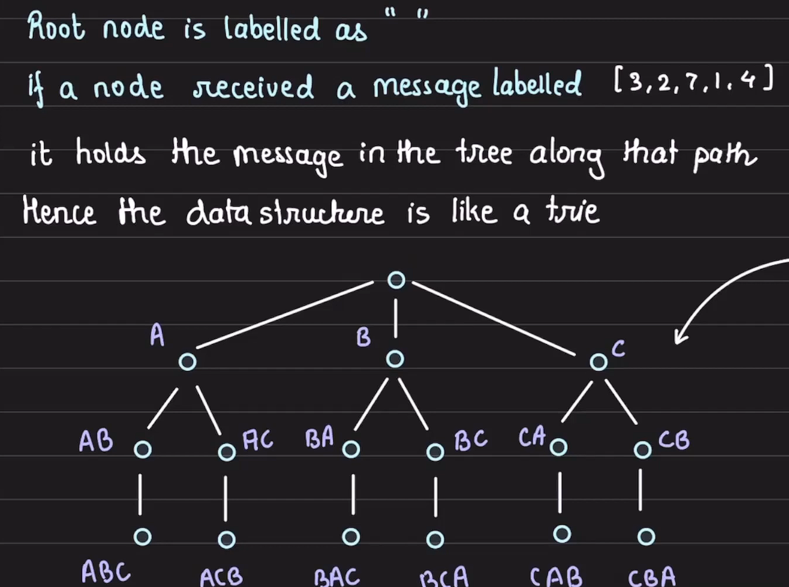
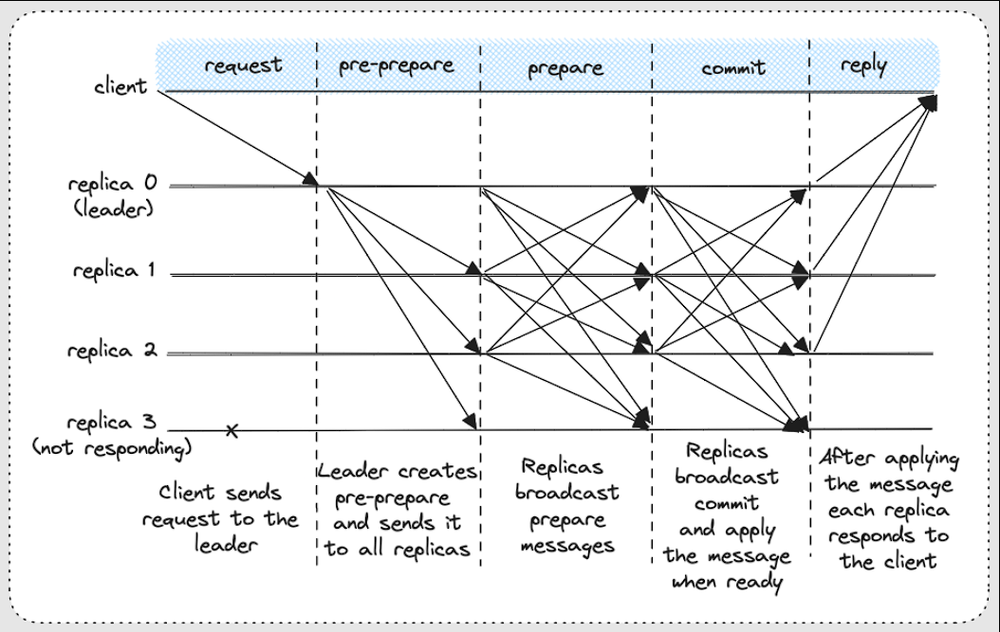

The Byzantine consensus problem is an interesting problem in distributed systems, even though it dates back to medieval times. The idea originates in medieval battle strategy, where all loyal generals must agree on a common battle plan; without it, their defeat is certain. There can be a few traitor generals among them. In large systems, the same set of ideas can be applied to introduce fault tolerance and achieve consensus even in the presence of a few adversarial nodes.

It's worth noting that the primary idea here is that all non-adversarial nodes must agree on a value, and that adversarial nodes are hard to detect. 

The following set of **assumptions** are made about the system to support Byzantine consensus:
- There are ***N*** nodes which communicate with each other by sending messages.
- Of the ***N*** total nodes, ***M*** are traitors (malicious, faulty, misbehaving, down).
- The non-traitor nodes do not know who the traitors are. The traitors can recognize one another and collude.
- One of the nodes (the king) initiates the distributed algorithm with an initial value.
- For all messages received, nodes can identify the sender node — traitors cannot spoof messages.
- Non-traitor nodes follow the distributed algorithm given.
- Traitor nodes may not follow the algorithm

Lamport, Shostak, and Pease proved that no algorithm exists for ***N < 3M+1*** that solves the Byzantine Generals problem, and gave a distributed algorithm that works for the ***N ≥ 3M+1*** case.

With ***M*** traitors, ***M+1*** stages are needed to ensure the correctness of the algorithm. These stages are referred to as the ***k=M*** stage, in which the king sends his order to the other ***N−1*** generals (first stage), all the way down to the ***k=0*** stage.

***python3
def decide():
    assert(done)
    global value
    if value is None:
        value = OM(path=shortest_path())
    return jsonify(value=value)

def shortest_path():
    return list(min(received_values.keys(), key=len, default=None))

def OM(path):
    k = 1 + m - len(path)
    value = received_values[tuple(path)]
    if k == 0:
        # print(f'node={id}: in stage {k} for OM({k}) for path={path} I am just returning the raw received message -> {value}')
        return value
    values = [value]
    # others = []
    for i in range(n):
        if i not in list(path) + [id]:
            # others.append(i)
            values.append(OM(list(path)+[i]))
    # print(f'node={id}: in stage {k} I received from path={path} value {vals[0]}, my OM({k-1}) values from others ({others}) are {vals[1:]} -> {majority(values)}')
    return majority(values)
***

The above algorithm is also known as Open Messaging, Exponential Information Gathering (EIG) Algorithm

The signed version of Lamport’s algorithm works as follows:
- **Node requirement:** Agreement among the honest nodes requires only ***N ≥ M+2. That means even if there are many traitors, as long as two honest nodes exist, they can still agree.
- **Signature verification:** Any message with an invalid signature is discarded immediately.
- **Forwarding:** If the signatures check out, the node accepts the message, adds the king’s proposed value to its set of received values, and forwards the message with its own signature appended.
- **Deduplication:** If a node has already seen the same signed value, duplicate messages can be ignored. In practice, this collapses the exponential message tree of the oral-messages algorithm to something much leaner.
- **Decision rule:** Once the cascade ends, each honest node applies a common choice() function to its set of received values. A simple rule is:
    - If there is exactly one value, return it.
    - Otherwise (zero or multiple values), return "retreat".

**Drawback:** Generating the signature takes longer.

All modern Byzantine Fault-Tolerant protocols — PBFT, Tendermint, HotStuff — rely heavily on digital signatures.

### Practical Byzantine Fault Tolerance (PBFT) algorithm:
It introduces the concept of a primary (leader), responsible for ordering client requests, while backups confirm and cross-check. Instead of flooding the system with cascades, PBFT uses quorum-based phases — pre-prepare, prepare, and commit — to reach agreement. It also optimizes cryptography: instead of signing every message, it uses lightweight message authentication codes (MACs) in normal operation, with signatures only during rare view-change events. The result is an ***O(n^2)*** message complexity instead of exponential.

### References
1. [Lamport's Byzantine Generals algorithm in Python](https://bytepawn.com/lamport-byzantine-generals.html)
2. [A more general implementation of Lamport's Byzantine Consensus algorithm in Python](https://bytepawn.com/lamport-byzantine-consensus.html)
3. [Exponential Information Gathering (EIG) Algorithm for Byzantine Agreement](https://www.youtube.com/watch?v=pi3YA3m1ffw)
4. [Lamport's Byzantine Consensus algorithm with Signatures](https://bytepawn.com/byzantine-consensus-with-signatures.html)
5. [A brief discussion of the Practical Byzantine Fault Tolerance (PBFT) algorithm](https://bytepawn.com/practical-byzantine-fault-tolerance.html)
