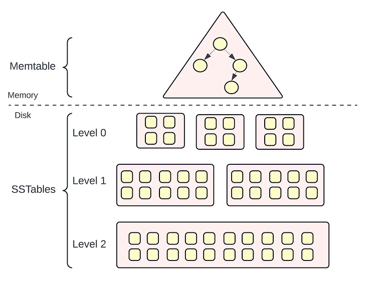
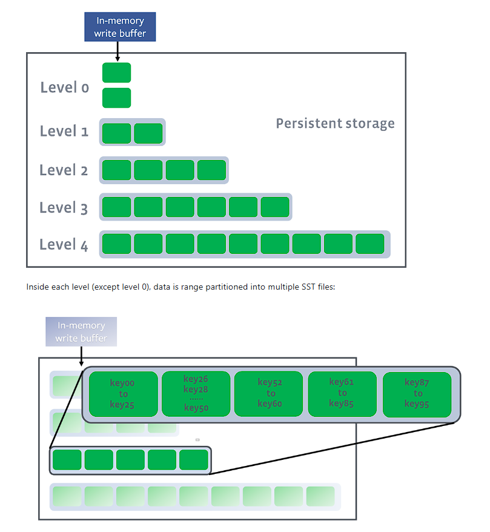
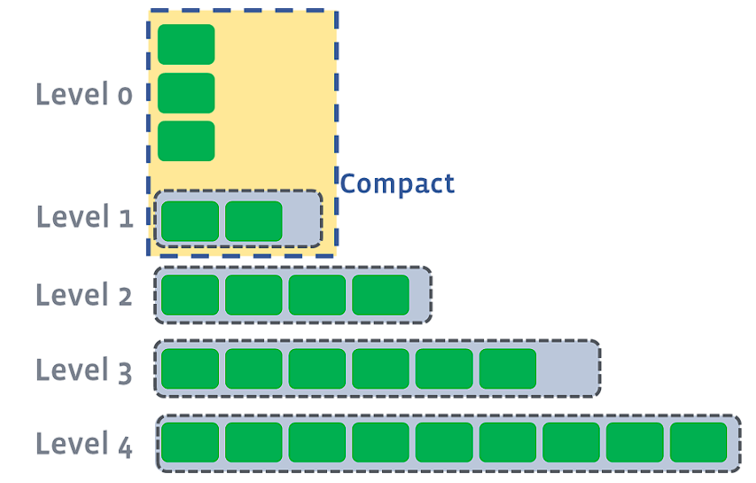
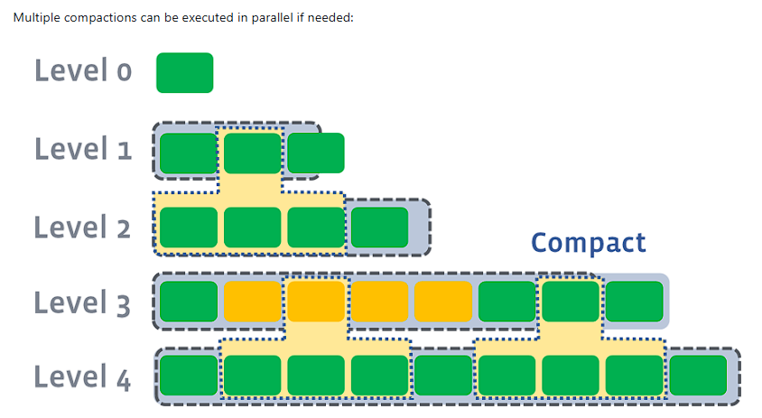

The Log-Structured Merge Tree, also known as an LSM tree, is one of the most popular storage engines, focusing on performant write operations. The benefit over the B+ Tree with this mechanism is that it requires only a single random block access to update the same data in the index. It's been heavily used in NoSQL DBs, though it's also being used in relational DBs.

### Building blocks

##### MemTable

A memtable is a data structure that holds data in memory before it’s flushed to disk. It is usually implemented as a balanced binary search tree.

A balanced binary search tree is a data structure in which the difference between the depths of the left and right subtrees is 0 or 1 at every node. Since the tree is balanced, the height of a balanced binary tree is O(logN), where N is the number of nodes in the tree.

##### SSTables (Sorted String Tables)

##### Compaction

There can be multiple L0 files that are not sorted; hence, compaction happens differently in L0 than in the other levels.

It's worth noting that data compaction reduces storage requirements over time. Also, there's a separate threshold at each level beyond which the compaction gets triggered, and that threshold limit increases exponentially at each level. This threshold value is dynamically determined to enable space amplification.

### References
1. [What is a log-structured merge tree (LSM tree)?](https://aerospike.com/blog/log-structured-merge-tree-explained/)
2. [The Log-Structured Merge-Tree (LSM Tree)](https://blog.acolyer.org/2014/11/26/the-log-structured-merge-tree-lsm-tree/)
3. [A deep dive: What is LSM tree?](https://vivekbansal.substack.com/p/what-is-lsm-tree)
4. [LSM Trees, Memtables & Sorted String Tables: An Introduction](https://www.darchuletajr.com/blog/lsm-trees-memtables-sorted-string-tables-introduction)
5. [Write throughput differences in B-tree vs LSM-tree based databases?](https://www.reddit.com/r/databasedevelopment/comments/187cp1g/write_throughput_differences_in_btree_vs_lsmtree/)
6. [Dynamic Level Size for Level-Based Compaction](https://rocksdb.org/blog/2015/07/23/dynamic-level.html)
7. [Option of Compaction Priority](https://rocksdb.org/blog/2016/01/29/compaction_pri.html)
8. [Leveled Compaction](https://github.com/facebook/rocksdb/wiki/Leveled-Compaction)
