This document discusses a few high-level concepts of PostgreSQL's internals. It's worth noting that, even though these are not needed in day-to-day activities, knowing them would certainly help understand queries and why some take longer.

SQL, short for Structured Query Language, is a high-level declarative language. Unlike imperative languages, it just specifies what info is needed and doesn't expose the internal details or how they're fetched. Thus, it might be confusing when the database is under load or when queries are not performing as expected.


### Storage:

Database indexes are represented as B-trees or other self-balancing trees. The non-leaf nodes are the keys and child node pointers, and the leaves contain the key and point to the actual location where the row is stored.


Postgres uses the concept of a page, where each page has a fixed size. Each page can contain a few entries, each specified with a block. The entries are internally identified as the pair of (page, block). This identification is known as ctid in PostgreSQL and can be fetched as part of the SQL query. 

```sql
SELECT ctid, * FROM your_table_name;
```


### Index

There are different types of indexes, even though the default is a BTree. This can also be found elsewhere. One of the most interesting indices is the BRIN (Block Range Index), which doesn't contain an entry for each row; it stores an entry for each block, reducing the index storage size to even less than 1% of the rest of the indexes. However, it should be noted that BRIN can be used only where there's a pattern in how data is stored at the storage layer, e.g., for time-series data.

Another important thing to consider is how to opt for an index.
Internally, index access takes very little time compared to fetching the whole entry directly from storage. Hence, these two items are identified differently, the index and heap, respectively.

#####  Scan strategies

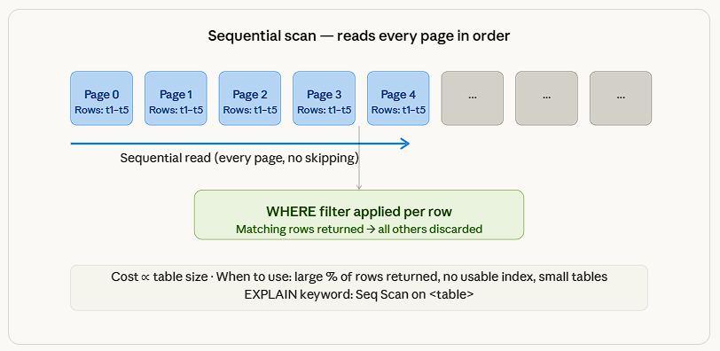

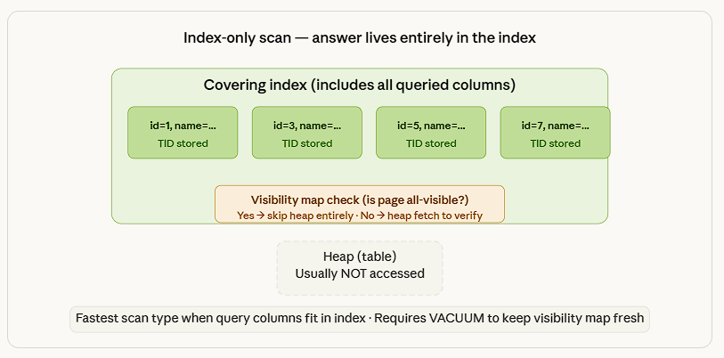

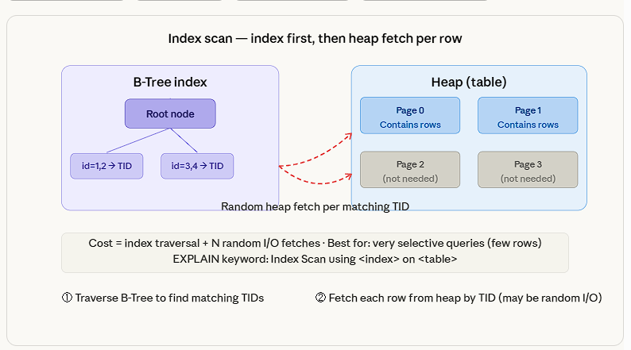

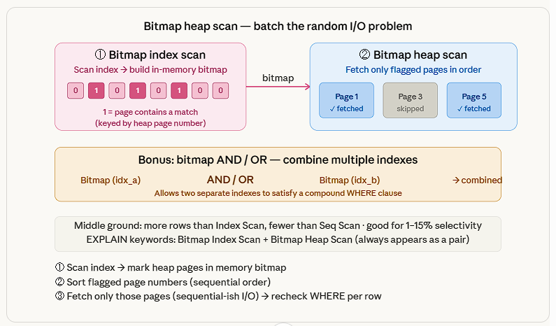

##### How to choose an index

**Things need to be kept in mind here:**
- Each index adds an extra overhead with write operations
- If a composite key is defined, then the same index can be used when the filter criteria is used with the first index key defined. Note that this works only with the first index key in the composite key and does not apply to the remaining keys.
- Use Partial Indexes to index only a subset of rows
```sql
CREATE INDEX idx_active_users ON users(email) WHERE is_active = TRUE;
```

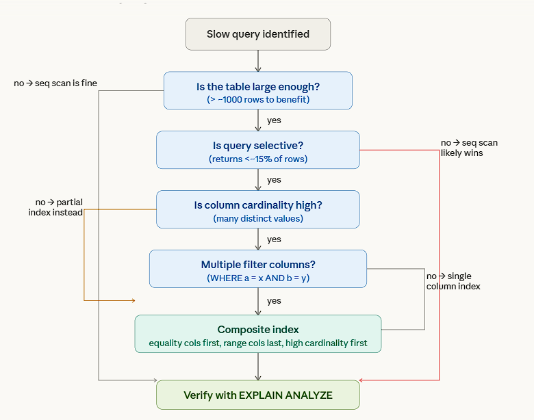


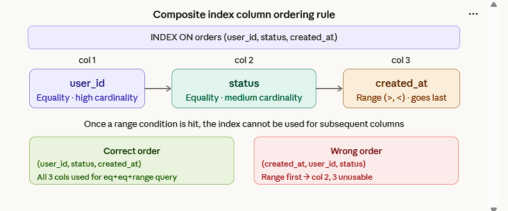

##### Use the right index type
B-Tree handles almost everything. GIN for JSONB, arrays, and full-text search. BRIN for huge append-only tables where physical order matches the column. GiST for geometry and custom range types.


Always opt for creating an index concurrently without blocking write operations on the table:

```sql
CREATE INDEX CONCURRENTLY idx_orders_user_id
ON orders (user_id);
```

##### Verification — How to Check Index Health & Usage

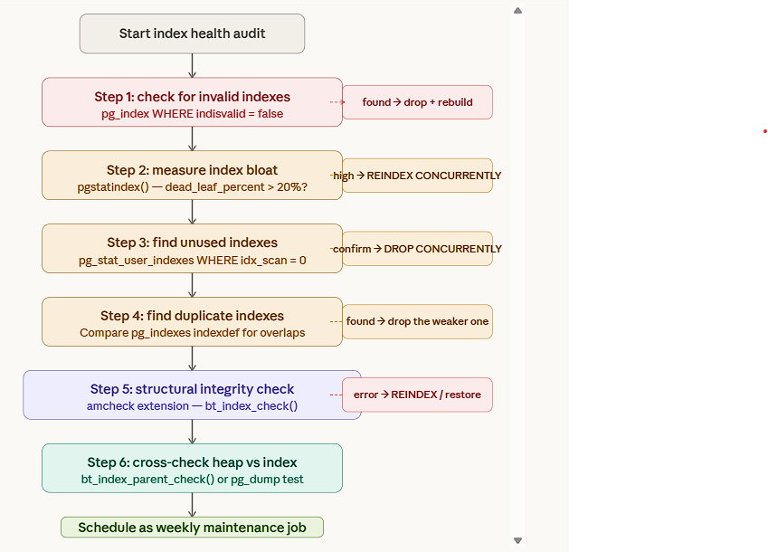

**Check if an index is being used**

```sql
SELECT schemaname, tablename, indexname, idx_scan, idx_tup_read, idx_tup_fetch
FROM pg_stat_user_indexes
ORDER BY idx_scan ASC;
```
idx_scan = 0 → the index has never been used — a candidate for removal.


**Check for unused indexes**

```sql
SELECT 
    indexrelid::regclass  AS index,     -- human-readable index name
    relid::regclass       AS table,     -- human-readable table name
    idx_scan                            -- how many times this index was scanned
FROM pg_stat_user_indexes                    -- statistics about indexes (user tables only)
JOIN pg_index USING (indexrelid)             -- join to get index metadata (especially uniqueness)
WHERE idx_scan = 0                           -- filter: index has NEVER been used
  AND indisunique = FALSE;                   -- filter: exclude UNIQUE / PRIMARY KEY indexes
```

**Caveat:** Not 100% perfect.
Some indexes are used in very rare queries or in bitmap index scans (the count is still usually captured). Always verify your important queries with EXPLAIN before dropping.

**Check index bloat**

```sql
SELECT 
    relname                          AS table,           -- name of the table
    indexrelname                     AS index,           -- name of the index
    pg_size_pretty(                                   -- makes the number nice to read (KB, MB, GB, etc.)
        pg_relation_size(indexrelid)                  -- actual size of the index in bytes
    )                                AS index_size
FROM pg_stat_user_indexes                                 -- statistics view for user indexes
ORDER BY pg_relation_size(indexrelid) DESC;               -- sort biggest indexes first
```

**Explain a query to see if the index is used**

```sql
EXPLAIN ANALYZE SELECT * FROM orders WHERE customer_id = 42;
```
Look for Index Scan or Bitmap Index Scan in the output — if you see Seq Scan, the index isn't being used.

```sql
CREATE EXTENSION IF NOT EXISTS amcheck;
SELECT * FROM pg_extension WHERE extname = 'amcheck';
CREATE EXTENSION IF NOT EXISTS pgstattuple;
```


### Use of optimistic lock vs pessimistic lock

Postgres uses an optimistic locking mechanism when performing table operations. This is handled by MVCC, which PostgreSQL employs internally. This ensures that a new version of the entry is created whenever an update operation is performed. This is maintained internally using two hidden system columns, xmin and xmax, to record transaction IDs.

It's worth noting that at the row level, Postgres employs pessimistic locking. When multiple queries update the same row, PostgreSQL internally uses a queuing strategy that processes row updates one at a time.


### Index wraparound

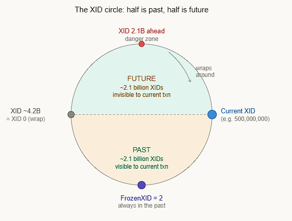

Every row written in PostgreSQL is stamped with the Transaction ID (XID) of the transaction that created it. PostgreSQL uses this stamp to decide visibility — "was this row written before or after my transaction?"
The problem: XIDs are 32-bit integers, so they max out at ~4.2 billion and then wrap back to zero — like an odometer rolling over. When this happens, old rows can suddenly appear in the future, making them invisible to all queries. PostgreSQL will actually shut down the database before allowing this to happen.


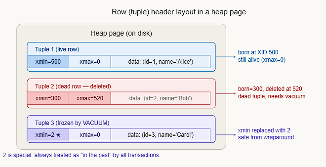

PostgreSQL doesn't think of XIDs linearly — it treats them as a circle, where exactly half (~2.1 billion) are considered "the past," and half are "the future" from any given XID. The key insight: PostgreSQL uses modular arithmetic — it doesn't compare XIDs with > or <, but checks "is B within 2.1 billion steps ahead of A on the circle?" If yes, B is in the future. If no, B is in the past.


##### How PostgreSQL determines visibility:

PostgreSQL compares current_xid vs row. xmin using the formula: if (current_xid - row.xmin) mod 2^32 < 2^31, then the row is visible. This is the modular circle — no signed integer comparison is used.


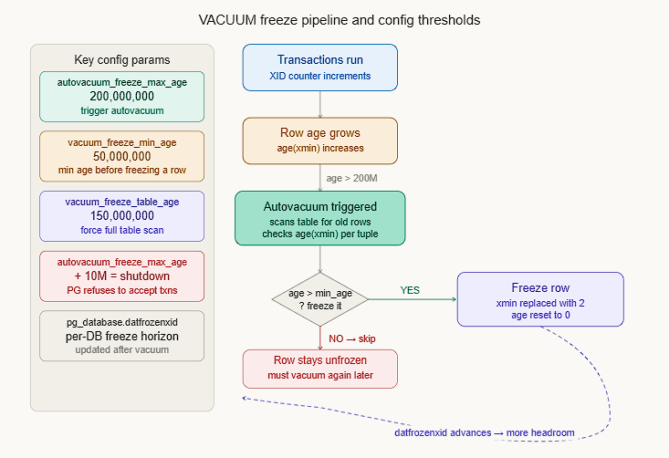


**Why FrozenTransactionId = 2 is special**
XID 2 is a hardcoded constant. The visibility check has a special case: any row with xmin = 2 is unconditionally treated as visible to all transactions, bypassing the circular math entirely. This is what VACUUM does when it "freezes" a row.
The three PostgreSQL warning levels you'll see in logs as XIDs age:

##### Detect XID wraparound risk 

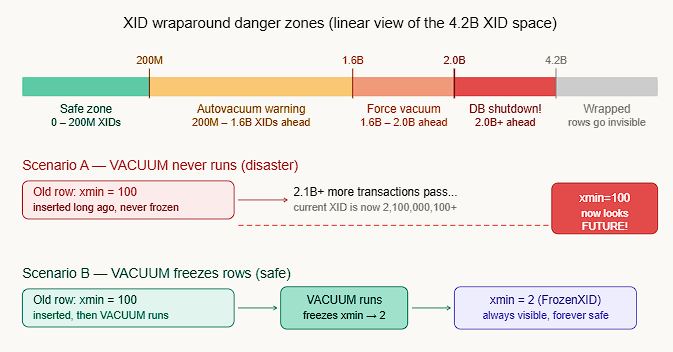

**Database Level**
```sql
SELECT datname, age(datfrozenxid), current_setting('autovacuum_freeze_max_age')
FROM pg_database
ORDER BY age(datfrozenxid) DESC;
```
Anything over 1.5B is urgent; force-vacuum a specific table immediately.

```sql
VACUUM FREEZE ANALYZE my_large_table;
```

**Table level**

```sql
SELECT 
    relname, 
    age(relfrozenxid) AS xid_age,
    pg_size_pretty(pg_total_relation_size(oid)) AS size
FROM pg_class
WHERE relkind = 'r'          -- only real tables (not indexes, views, sequences…)
ORDER BY xid_age DESC
LIMIT 10;
```

### How deletion works

DELETE doesn't remove data immediately due to MVCC (Multi-Version Concurrency Control) restrictions. When a row is deleted, other transactions that started before the delete may still need to see the old version of that row. Physically erasing it would break those readers. So PostgreSQL keeps the dead tuple alive until it's guaranteed that no active transaction can see it anymore. Only then can VACUUM safely remove it.

```sql-- You can watch the relfilenode change:
SELECT relfilenode FROM pg_class WHERE relname = 'orders';
-- Returns: 24601

TRUNCATE orders;

SELECT relfilenode FROM pg_class WHERE relname = 'orders';
-- Returns: 24890  ← completely new file
```

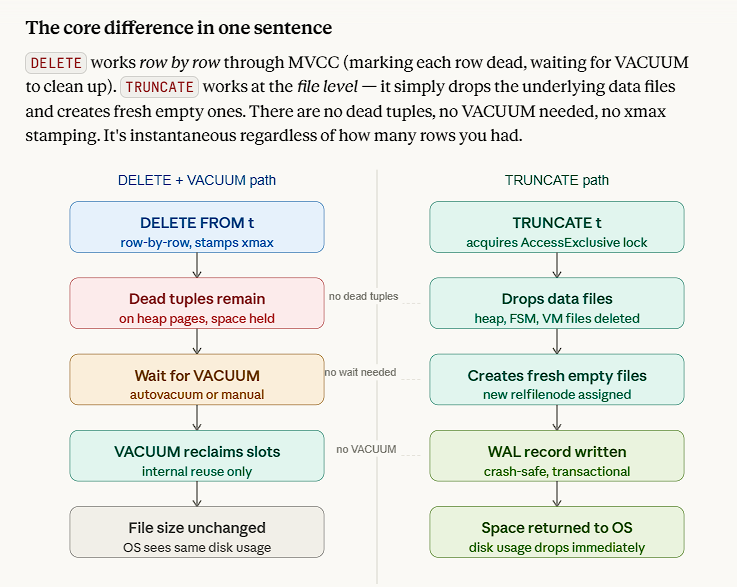

**Caveat: TRUNCATE holds a table lock**

Unlike in MySQL, PostgreSQL's TRUNCATE participates in transactions and can be rolled back.
